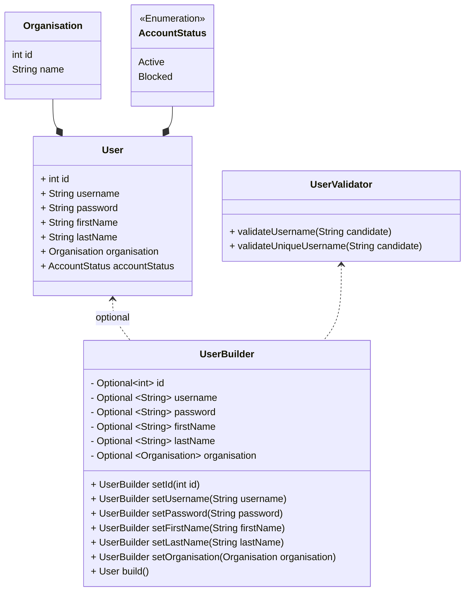
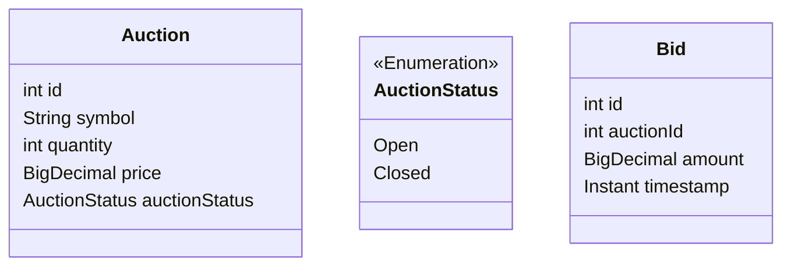
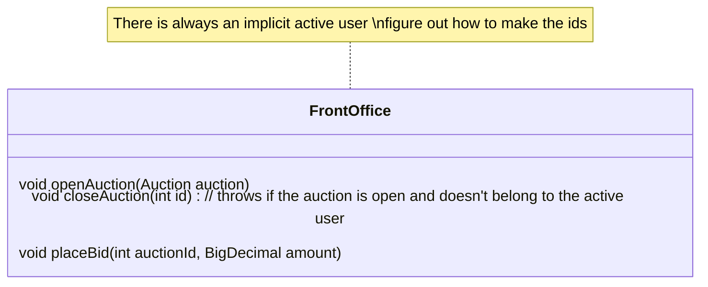
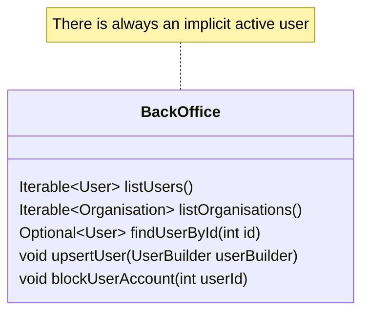

# AuctionHouse

- how can an user bid on an auction if there's no API to list auctions that were not created by the current user?
- what's the shape of a bid?
- probably listing of auctions should take a predicate
- auctions are like the auction for promises we make at Adaptive, where people bids for other people's promises and everyone has to pay, not only the person who wins the auction; and not like real auctions where only the highest bidder pays.

## User and Account

- Implicitly a namespace

## Bid

## Front Office

## Back Office

